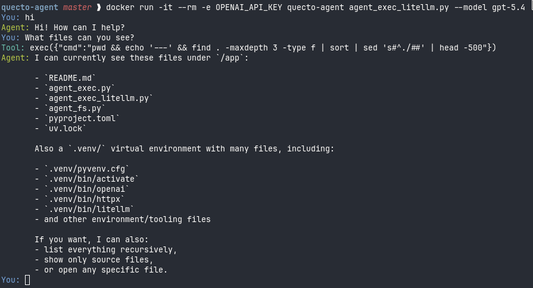

# Quecto Agent

Quecto Agent is set of extremely dense agents, with the most capable (`agent_full.py`) having:

- Stylized chat
- Full agent support for any provider
- Tool use
- MCP plugin support
- Reads AGENTS.md
- Skill discovery

All under 100 lines of Python



In a nutshell:

- `agent_fs.py`: a single `fs` tool (list/read/write files under the working directory)
- `agent_exec.py`: a single `exec` tool (runs shell commands verbatim; Docker recommended)
- `agent_exec_litellm.py`: same `exec` tool, but uses LiteLLM so you can choose model/provider
- `agent_full.py`: `exec` (LiteLLM, Docker recommended) + AGENTS.md autoload + Skill discovery + MCP client loading

## Setup

```bash
uv sync
export OPENAI_API_KEY="..."
```

## Run

```bash
uv run agent_fs.py
```

Model is `gpt-5.4` by default.

## Docker

```bash
docker build -t quecto-agent -f docker/Dockerfile .
```

## Exec agents (Docker recommended)

These agents run arbitrary shell commands. Run them in Docker.

```bash
# OpenAI (gpt-5.4)
docker run -it --rm -e OPENAI_API_KEY quecto-agent agent_exec.py

# LiteLLM (OpenAI)
docker run -it --rm -e OPENAI_API_KEY quecto-agent agent_exec_litellm.py --model gpt-5.4

# LiteLLM (Anthropic)
docker run -it --rm -e ANTHROPIC_API_KEY quecto-agent agent_exec_litellm.py --model anthropic/claude-opus-4-7

# LiteLLM + extras (AGENTS.md + skills + MCP)
docker run -it --rm -e OPENAI_API_KEY quecto-agent agent_full.py --model gpt-5.4
```
